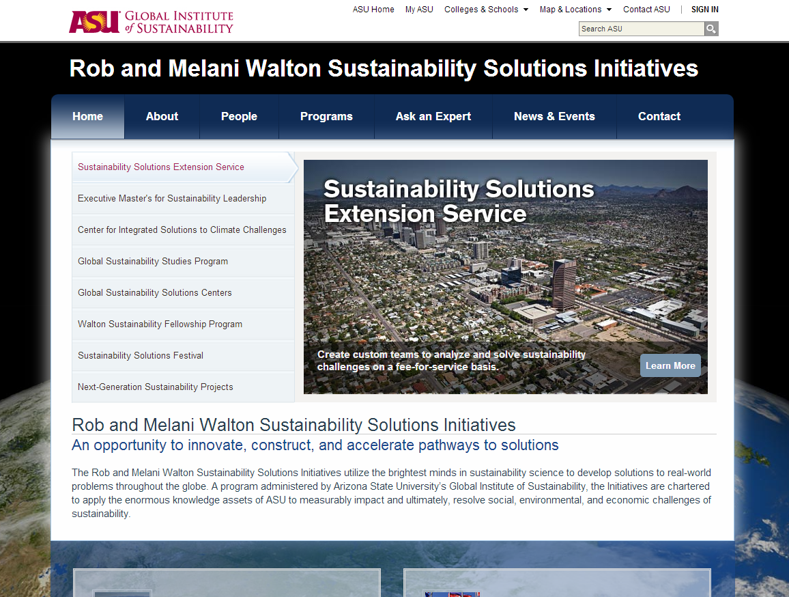

Sustainability Solutions Wordpress Theme
========================================



For the new [Walton Sustainability Solutions](https://sustainabilitysolutions.asu.edu) site.

Uses the [Web Standards Wordpress Repo](https://github.com/gios-asu/ASU-Web-Standards-Wordpress-Theme) as the Parent Theme. 

# Requirements

* Wordpress ~4.0
* [ASU-Web-Standards-Wordpress-Theme](https://github.com/gios-asu/ASU-Web-Standards-Wordpress-Theme) - the repo **must** be checked out to the folder name: "ASU-Web-Standards-Wordpress-Theme"

# Development

To start developing, you will need:
* [NodeJS](https://nodejs.org/)
* [Grunt](http://gruntjs.com/) installed globally
* [Ruby](https://www.ruby-lang.org/en/)
* [PHP 5.6+](http://php.net/downloads.php)
* [Composer](https://getcomposer.org/doc/00-intro.md) installed globally

Then run:

```cmd
sudo npm install
bundle install
composer install
```

To make a new build, simply run:

```cmd
grunt
```

Grunt will compile JavaScript into a minified file, compile SCSS to a minified CSS file, and check PHP files for coding standards.

## Writing Code

* Always pass `grunt` before committing.
* Always try to use Wordpress functions instead of writing your own.
* Do not use the style.css to write any styles.  Please only use SCSS.
* Break up your SCSS files!
